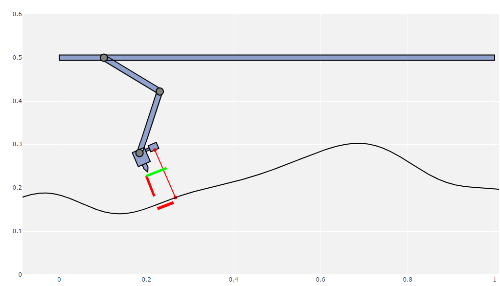

This repository is used to evaluate the performance of using MPC for 2D surface following.

To run the docker container, execute the following command:
```console
docker run -it -p 8888:8888 -e GRANT_SUDO=yes --user root -v <path_to_repository>:/external_data ruanviljoen/surfacefollowing bash
```

Once inside the container, start jupyter lab as follows:

```console
jupyter lab --allow_root
```